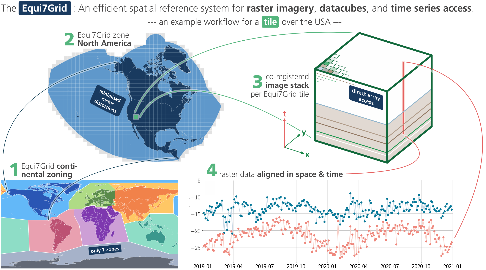

# Equi7Grid

[](https://github.com/TUW-GEO/Equi7Grid/actions/workflows/ubuntu.yml)
[](https://github.com/TUW-GEO/Equi7Grid/actions/workflows/windows.yml)
[](https://coveralls.io/github/TUW-GEO/Equi7Grid?branch=master)
[](https://badge.fury.io/py/Equi7Grid)
[](https://equi7grid.readthedocs.io/)

The **Equi7Grid** is a spatial reference system designed to handle efficiently the archiving, processing, and displaying of **high resolution raster image data**. It supports geo-datacubes holding large volumes of satellite imagery, as it preserves geometric accuracy and **minimises data oversampling over global land surfaces** to a very low value of 3%.

---



This package contains:
- Geometries and projection-files defining the contentinal zones, coordinate system, projection parameters, base tilings, etc.
- A python class for working with Equi7Grid: how to convert to, how to use the tiling system, how to identify coordinates, etc.

A detailed documentation on the Equi7Grid definition is at

`~/docs/doc_files/`

and its scientific background is published in this [**journal article**](https://www.sciencedirect.com/science/article/pii/S0098300414001629).

## News

**2025 October:**

We’re currently preparing a version 2 of the Equi7Grid and its software. For this, we collect user needs and requests, and develop an modular approch for more flexible options for pixel samplings and grid tilings. 

Contributions—whether comments, recommendations, or code—are welcome, and are collected here in the [**Discussion Section**](https://github.com/TUW-GEO/Equi7Grid/discussions) section

**2024 May:**

For the seven continental Equi7 coordinate systems, the newly available **EPSG codes**  `EPSG:27701` - `EPSG:27707` are available via
+ with `proj>=9.4.0` from the generic coordinate transformation software [**proj**](https://proj.org/en/9.4/) (e.g. used within [**GDAL/OGR**](https://gdal.org/index.html)>=3.9.0).
+ with `EPSG>=v11.002` from the Geodetic Parameter Dataset of [**EPSG**](https://epsg.org/home.html)
+ with `QGIS>=3.36` and its versatile and open geographic information system ([link](https://qgis.org/en/site/))

Several updates are in the pipeline of this python package:
+ interface to the **EPSG codes**
+ updates on the **continental zone bordes** - streamlining along political delimiters
+ **flexible tile extents** and grid samplings, allowing also user-defined tile extents
+ updated interfaces to **reprojection methods** (e.g. to and from UTM, or LonLat)

## Geometries

Easiest access to Equi7's seven continental coordinate reference systems (CRSs) is via the EPSG codes:

```
Africa         EPSG:27701
Antarctica     EPSG:27702
Asia           EPSG:27703
Europe         EPSG:27704
North America  EPSG:27705
Oceania        EPSG:27706
South America  EPSG:27707
```
For example, when using `pyproj>=3.6.1` in python, you can transform coordinates like this:

```py
from pyproj import Transformer
lon, lat = Transformer.from_crs("EPSG:27704", "EPSG:4326", always_xy=True).transform(x, y)
```

Shapefiles for the continental zone boundaries and tilings are here

`~/src/equi7grid/grids/`

... with files in `PROJ` projected to the Equi7Grid space (meters), and in `GEOG` corresponding files in common geographic Lon-Lat space (degrees):

Overlays for visualisation in Google Earth are here:

`~/docs/doc_files/google_earth_overlays/`

The 7 projections (or more precisely the Projected Coordinate Reference Systems, PROJCS) are completely defined by WKT-strings in the .prj-files at

`~/wkt/`

or simply by following **proj4-strings**:

```
AF: '+proj=aeqd +lat_0=8.5 +lon_0=21.5 +x_0=5621452.01998 +y_0=5990638.42298 +datum=WGS84 +units=m +no_defs'
AN: '+proj=aeqd +lat_0=-90 +lon_0=0 +x_0=3714266.97719 +y_0=3402016.50625 +datum=WGS84 +units=m +no_defs'
AS: '+proj=aeqd +lat_0=47 +lon_0=94 +x_0=4340913.84808 +y_0=4812712.92347 +datum=WGS84 +units=m +no_defs'
EU: '+proj=aeqd +lat_0=53 +lon_0=24 +x_0=5837287.81977 +y_0=2121415.69617 +datum=WGS84 +units=m +no_defs'
NA: '+proj=aeqd +lat_0=52 +lon_0=-97.5 +x_0=8264722.17686 +y_0=4867518.35323 +datum=WGS84 +units=m +no_defs'
OC: '+proj=aeqd +lat_0=-19.5 +lon_0=131.5 +x_0=6988408.5356 +y_0=7654884.53733 +datum=WGS84 +units=m +no_defs'
SA: '+proj=aeqd +lat_0=-14 +lon_0=-60.5 +x_0=7257179.23559 +y_0=5592024.44605 +datum=WGS84 +units=m +no_defs'
```

## User installation

This package can be installed through pip:

```bash
pip install Equi7Grid
```

Installs for `scipy` and `gdal` are required from conda or conda-forge (see [below](#devinst) how to set up a fresh environment).

## Usage examples

The `Equi7Grid` package provides python tools to interact with different projections, query information from the Equi7Grid geometries, and access the tiling system.

### Example 1: Retrieving Equi7 tiles covering a region of interest

You can retrieve all tiles covering a region of interest defined using Lon-Lat coordinates using `search_tiles_in_roi`:

<!-- snippet: search-tiles-in-lon-lat-roi -->
<a id='snippet-search-tiles-in-lon-lat-roi'></a>
```py
tiles = Equi7Grid(500).search_tiles_in_roi(bbox=[(0, 30), (10, 40)], coverland=True)
assert sorted(tiles) == sorted([
    'EU500M_E036N006T6', 'EU500M_E042N000T6', 'EU500M_E042N006T6',
    'AF500M_E030N084T6', 'AF500M_E030N090T6', 'AF500M_E036N084T6',
    'AF500M_E036N090T6', 'AF500M_E042N084T6', 'AF500M_E042N090T6'])
```
<sup><a href='/tests/test_equi7grid.py#L327-L333' title='Snippet source file'>snippet source</a> | <a href='#snippet-search-tiles-in-lon-lat-roi' title='Start of snippet'>anchor</a></sup>
<!-- endSnippet -->

### Example 2: Reproject a GeoTIFF file to Equi7 tiles
The package provides with the `image2equi7grid()` a convenient method to quickly convert existing raster data stored as GeoTIFFs to tiles in Equi7Grid projection(s):

<!-- snippet: image2equi7grid-example -->
<a id='snippet-image2equi7grid-example'></a>
```py
input_file = input_dir / "lake_in_russia_lonlat.tif"
image2equi7grid(Equi7Grid(100), input_file.as_posix(), out_dir.as_posix())

assert (out_dir / "EQUI7_AS100M/E018N066T6/lake_in_russia_lonlat_AS100M_E018N066T6.tif").exists()
assert (out_dir / "EQUI7_EU100M/E072N030T6/lake_in_russia_lonlat_EU100M_E072N030T6.tif").exists()
```
<sup><a href='/tests/test_approve_image2equi7grid.py#L18-L24' title='Snippet source file'>snippet source</a> | <a href='#snippet-image2equi7grid-example' title='Start of snippet'>anchor</a></sup>
<!-- endSnippet -->

The tool uses `gdal` to efficiently warp the raster data to the Equi7 projection, and generate a folder structure for each Equi7 tile that covers the input raster.

**Note 1**: The input file of this (advanced) example lies between Asia and Europe, and by default the function writes output for all tiles that cover the input, in this example for  the Equi7 tiles *EU100M_E072N030T6* and *AS100M_E018N066T6*. Checkout the function `image2equi7grid()` for more options on output, format, encoding, etc.

**Note 2**: Windows users might need to manually specify the `gdal_path` as part of the function arguments, for example:
```py
image2equi7grid(gdal_path=r"C:\...your_path...\envs\equi7grid\Library\bin")
```

### Example 3: Reproject Equi7 tiles to the Longitude-Latitude projection
With `equi7_to_lonlat()`, a simple but convenient method is available to quickly convert files that are already gridded and tiled in the Equi7Grid. Please see the following usage example:

<!-- snippet: equi7_to_lonlat-example -->
<a id='equi7_to_lonlat-example'></a>
```py
equi7_to_lonlat(roi=(9, 46, 18, 50),
                pixelsize=20,
                input_folder_path = r'C:\...your_main_path...\EQUI7_SUBGRID\TILE',
                input_file_path = 'your_dataset_SUBGRID_TILE.tif',
                full_output_path = r'C:\...your_main_path...\your_dataset_46-50LON_9-18LAT.tif',
                gdal_path = r'C:\...your_GDAL_path...\Library\bin',
                ...
                )
```
<sup><a href='/src/equi7grid/equi7_to_lonlat.py#L284-L300' title='Snippet source file'>snippet source</a> | <a href='#equi7_to_lonlat-example' title='Start of snippet'>anchor</a></sup>
<!-- endSnippet -->

### More examples ...
checkout the tests at

`~/tests/test_equi7grid.py`

which exemplify many more functions.

## <a name="devinst"></a>Development installation

For development, we recommend using the `make` tool to automatically create python environments and install more complex
dependencies i.e. `gdal`.

Instruction on how to set up an environment on systems without proper `make` support, such as Windows, can be found in a
subsequent section.

### Creating python environments with *make*

#### Conda

Make sure miniconda3 is installed by following
the [official installation instructions](https://conda.io/projects/conda/en/stable/user-guide/install/index.html).
To create a new development environment using `conda` make the `conda` rule:

```bash
make conda
```

This will create a new conda environment called `equi7grid` and install all necessary dependencies.

#### Virtualenv

Make sure you have installed `virtualenv` and `gdal` on your system.
For instance under Ubuntu you can install gdal using ``apt install libgdal-dev``, and `virtualenv`
using ``apt install python3-venv``.
To set up a virtualenv environment simply make the `venv` rule:

```bash
make venv
```

This will create a `virtualenv` environment within a `venv` folder at the root of the project.
It will install the `gdal` dependency using [pygdal](https://pypi.org/project/pygdal/) which requires `gdal` to be
installed on the system.

#### Installing test dependencies

To create a testing environment you can set the `TEST_ENV=1` parameter:

```bash
make venv TEST_ENV=1
```

After activating the environment you can make the `test` rule to run all unit tests:

```bash
make test
```

### Creating python environments on Windows

First make sure miniconda3 is installed on your system by following
the [installation instructions](https://conda.io/projects/conda/en/stable/user-guide/install/index.html).

Create the `equi7grid` conda environment from the `environment.yml` provided at the root of the repository.

```
conda env create -f environment_win.yml
```

See also the official anaconda documentation
for [detailed instructions on environments and environment files](https://conda.io/projects/conda/en/latest/user-guide/tasks/manage-environments.html).

Now you should be able to activate the environment:

```
conda activate equi7grid
```

Once activate, you can install the `Equi7Grid` package in development mode using pip by running the following command in
the root directory of the repository:

```
pip install -e .
```

#### Installing test dependencies

To install the test dependencies as well use:

```
pip install -e .[testing]
```

Now you should be able to run all unit tests:

```
pytest tests/
```

You can also have a look at the source of the Makefile for more detailed installation and testing options.

## Contribute

We are happy if you want to contribute. Please raise an issue explaining what
is missing or if you find a bug. We will also gladly accept pull requests
against our master branch for new features or bug fixes.

### Guidelines

If you want to contribute please follow these steps:

- Fork the Equi7Grid repository to your account
- Clone the repository
- make a new feature branch from the Equi7Grid master branch
- Add your feature
- Please include tests for your contributions in one of the test directories.
  We use py.test so a simple function called test_my_feature is enough
- submit a pull request to our master branch

## Citation

[](https://doi.org/10.5281/zenodo.1048530)

If you use the software in a publication then please cite it using the Zenodo DOI.
Be aware that this badge links to the latest package version.

Please select your specific version at https://doi.org/10.5281/zenodo.1048530 to get the DOI of that version.
You should normally always use the DOI for the specific version of your record in citations.
This is to ensure that other researchers can access the exact research artefact you used for reproducibility.

You can find additional information regarding DOI versioning at http://help.zenodo.org/#versioning
