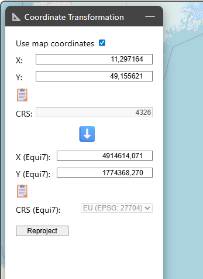
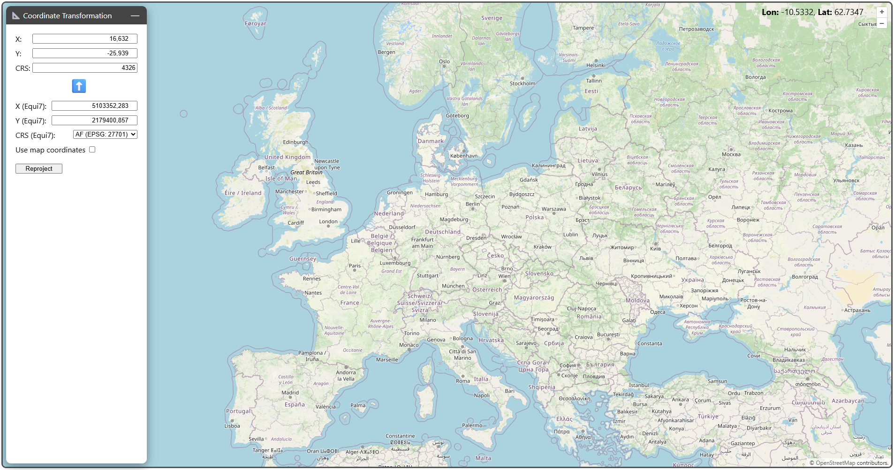

# Coordinate transformer

The coordinate transformer provides an interface to a coordinate tuple in any projected reference system to the Equi7Grid and vice versa.

A nice feature is that you can directly use the map coordinates and autofill them into the form via a right click on the map. To do so, you need to toggle the _Use map coordinates_ checkbox. As long as this checkbox is ticked, the _CRS_ box is deactivated and set to the LonLat system (4326).

If you want to reproject different coordinates you can enter them manually next to the source coordinate reference system. After clicking on _Reproject_ the coordinates are transformed into the Equi7Grid system and inserted into the respective coordinate boxes. The corresponding Equi7Grid continent is also autodected.

If you want to transform coordinates from the Equi7Grid system to any other projection system, you can change the direction of the blue arrow by clicking on it (from ⬇️ to ⬆️). Before triggering the reprojection, you need to enter the desired target coordinate reference system in _CRS_.

