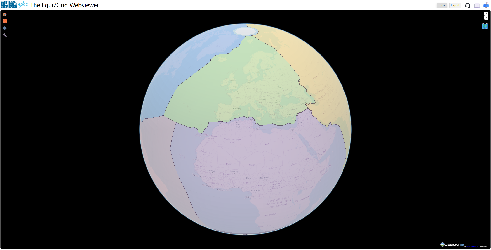
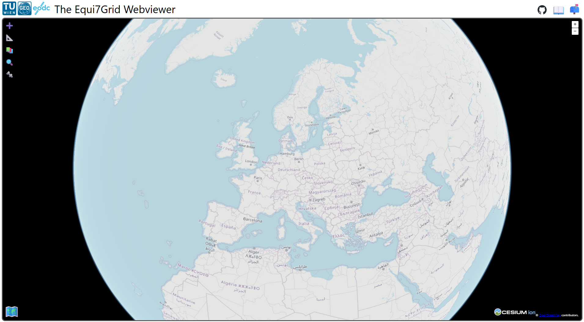
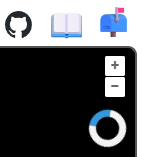

# Equi7Grid webviewer

The Equi7Grid webviewer is a tool to display and interact with the tiles, tilings, coordinates and projection zones of the Equi7Grid system. It was created as a high-level interface for users, who want to get a visual understanding of the grid system without touching any code. But the tool is alse very helpful for advanced users, e.g., to fetch tile lists, export geotransformation parameters for further data processing and analyse new tiling schemes.

## Home view

When you launch the Equi7Grid webviewer, the screen looks like this:



The header contains several links:

On the left side you have two logos/links to the creators of the Webviewer and the Equi7Grid itself. On the right side there is a link to the GitHub repo (), to the Equi7Grid documentation (📖), and to GitHub issues to report problems or to request new features (📬).


## Map

The map itself displays OpenStreetMap in the background and interactions with the map are intuitive, including zoom buttons in the top-right corner. In the lower-left corner you can see a globe. If you click on it, your map will start to render as a globe in 3D.

:::{note}
The 3D view only works in Chrome.
:::



The globe changed to a map icon. If you click on it again, you will get back to the 2D map view.

You may have noticed that after the page has loaded, the globe icon is not yet visible. Instead, a loading circle is visible:



This symbol appears when the required data layers (tilings, zones, etc.) are pre-loaded in the background. It is also visible when adding a new tiling (➕) with the tiling tool or within the layer manager.

## Toolbar

On the left you have a set of tools you can use to interact with the map and displayed items:

- [Add tiling](./tiling.md) (➕)
- [Coordinate transformations](./coordinate_transformation.md) (📐)
- [Layer manager](./layers.md) (📚)
- [Tile query](./tiles.md) (🔍)
- [Display settings](./settings.md) (🔩)

```{toctree}
:hidden:

tiling.md
coordinate_transformation.md
layers.md
tiles.md
settings.md
```
