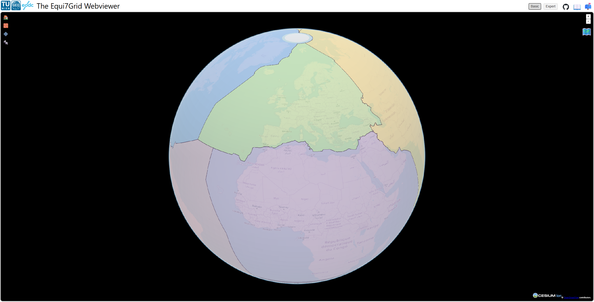
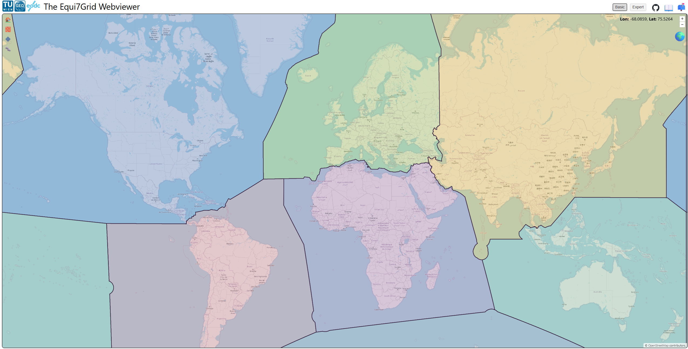
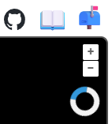

```{toctree}
:hidden:

basic.md
expert.md
```

# Equi7Grid webviewer

The Equi7Grid webviewer is a tool to display and interact with the tiles, tilings, coordinates and projection zones of the Equi7Grid system. It was created as a high-level interface for users, who want to get a visual understanding of the grid system without touching any code. But the tool is alse very helpful for advanced users, e.g., to fetch tile lists, export geotransformation parameters for further data processing and analyse new tiling schemes.

## Home view

When you launch the Equi7Grid webviewer, the screen looks like this:



The header contains several links:

In the upper-left corner you have two logos/links to the creators of the Webviewer and the Equi7Grid itself. On the right side there is a link to the GitHub repo (), to the Equi7Grid documentation (📖), and to GitHub issues to report problems or to request new features (📬). On the left next to these icons there are two important buttons which steer the level of interactivity with the webviewer: "Basic" and "Expert". The following pages describe the tools belonging to each mode in more detail:

- [Basic mode](basic.md)
- [Expert mode](expert.md)


## Map

The map itself displays a globe in 3D by default and offers intuitive interaction like panning and zooming with the mouse. Manual zooming is possible with the buttons in the upper-right corner. Below the zoom buttons you can see a map icon. If you click on it, you can switch your map view from 2D (🗺️) to 3D (🌍) and vice versa.

:::{note}
The 3D view renders with CesiumJS, which requires WebGL in the background. It may happen that your browser displays an error in the console like this: "Browser supports WebGL, but initialization failed". Check your performance settings and allow hardware acceleration if possible. Please switch to a different browser if this is not working.
:::



The 2D view offers the same level of interaction and displays geographic coordinates in the upper-right corner by hovering over the map. You may have noticed that after the page has loaded, the globe icon is not yet visible. Instead, a loading circle is visible:



This symbol appears when the required data layers (tilings, zones, etc.) are pre-loaded in the background. It is also visible when adding a new tiling (➕) with the [tiling tool](tiling.md) or within the [layer manager](layers.md). While data loading is ongoing, the toolbar is disabled.
