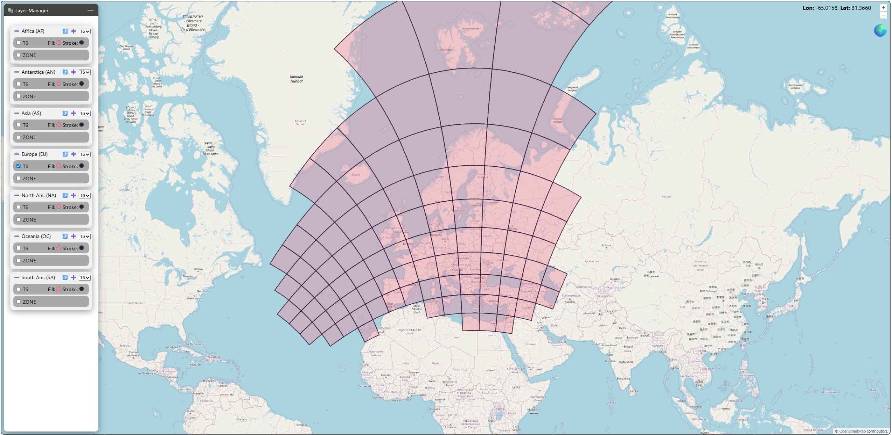
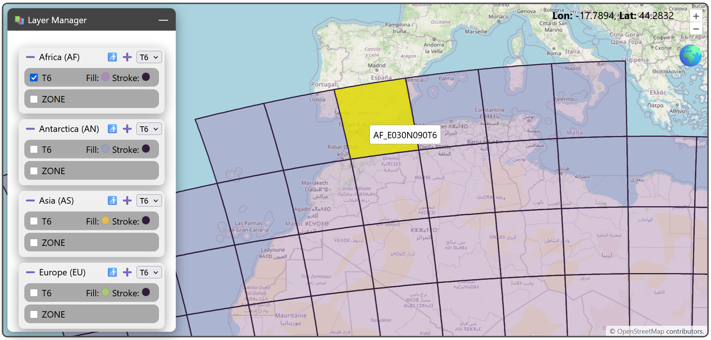
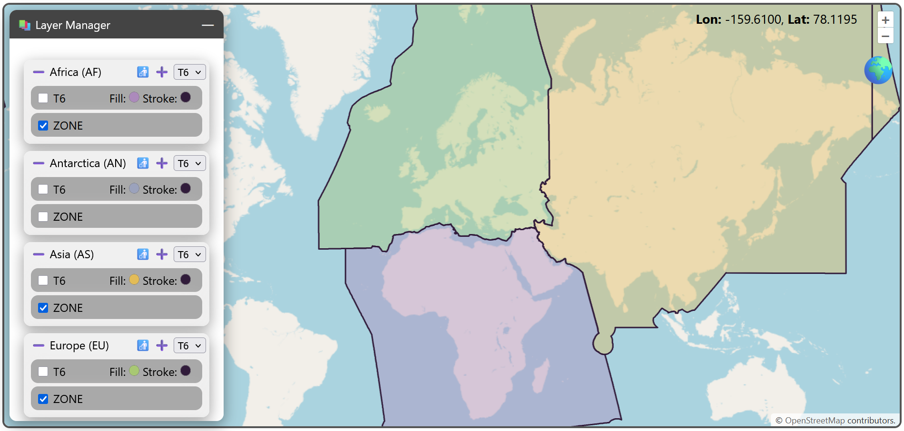
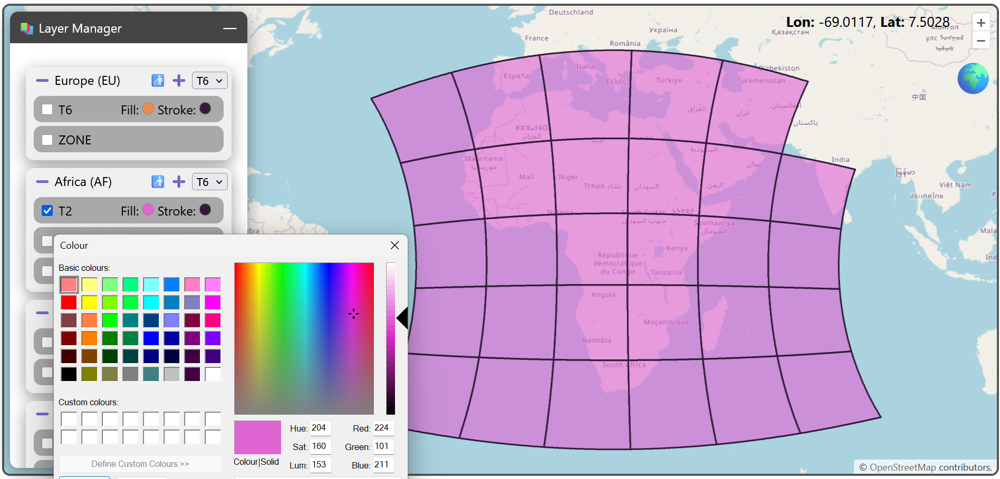
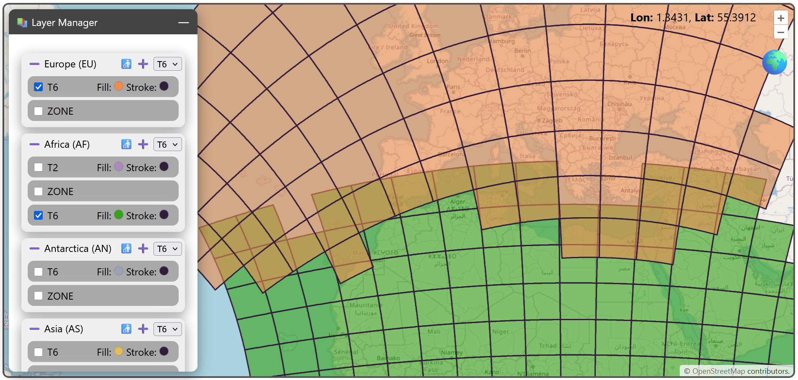
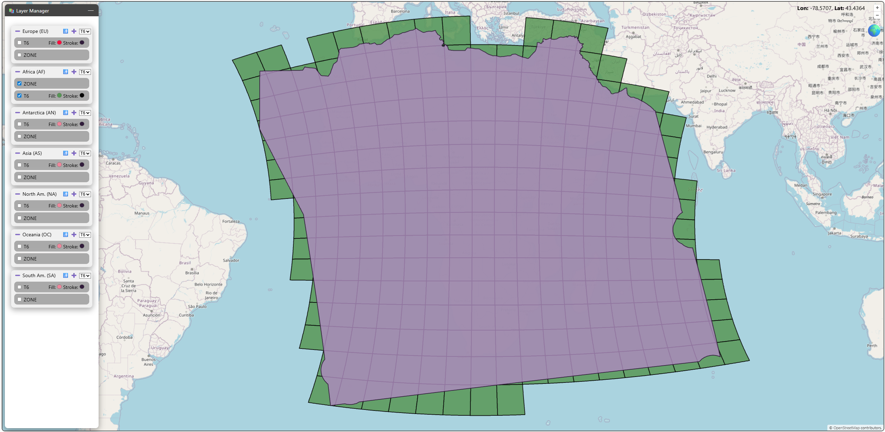

# Layer manager

The layer manager is a core tool of the webviewer allowing to define which and how layers are displayed. In addition you can remove and add new tilings to the webviewer.

The following image shows the default view of the layer manager panel. By clicking on the checkbox next to each layer, you can display it on the map:

You can interact with the layer by clicking on the tiles to display the tilename.

In the layer manager panel, you have layers grouped by Equi7Grid continent and the respective zone and tilings for each continent. The ➖ symbol will minimise the group. The symbols on the right side of the group manage layer loading and deletion. After selecting the tiling ID in the dropdown menu you can either remove the tiling with 🚮 or add it with ➕. Note that any non-standard tiling scheme needs to be added via the [tiling creator](./tiling.md).

Under each continent you can find a zone layer representing the projection zone of a Equi7Grid continent.

Except the zone layers, you can modify the stroke and fill colour of all tiling layers.

All items are draggable to change the display order. This means you can drag the continent groups to achieve the desired visual overlay

or you can do the same within a continent group and change the order of the zone and tilings.

