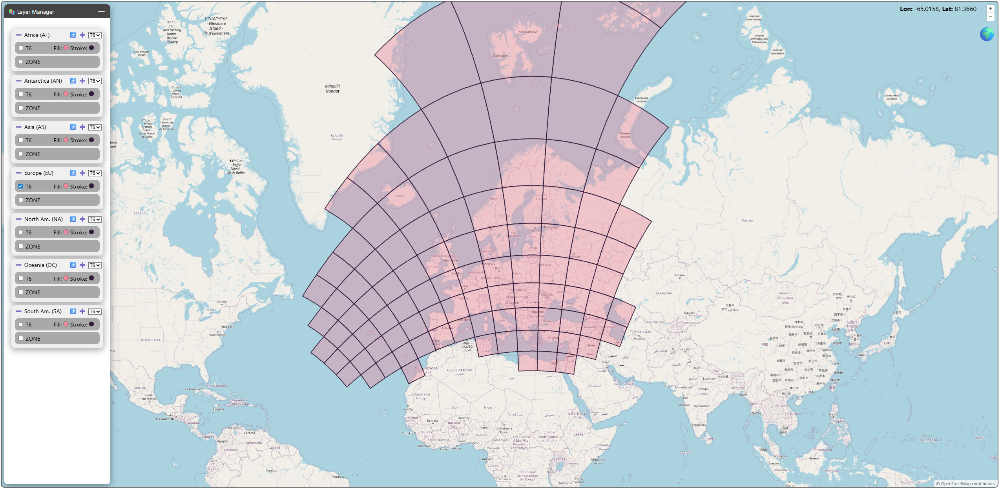
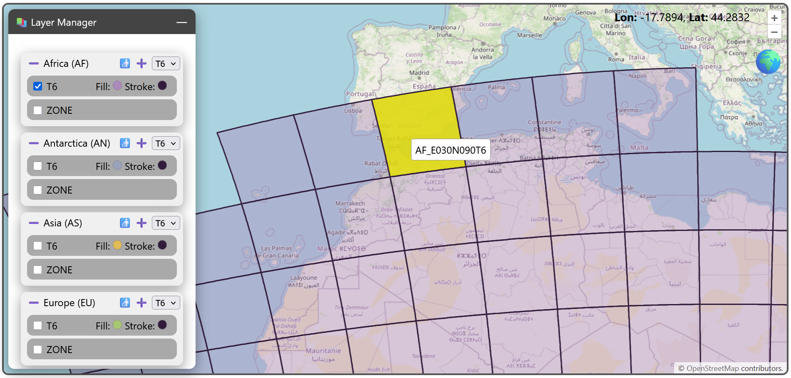
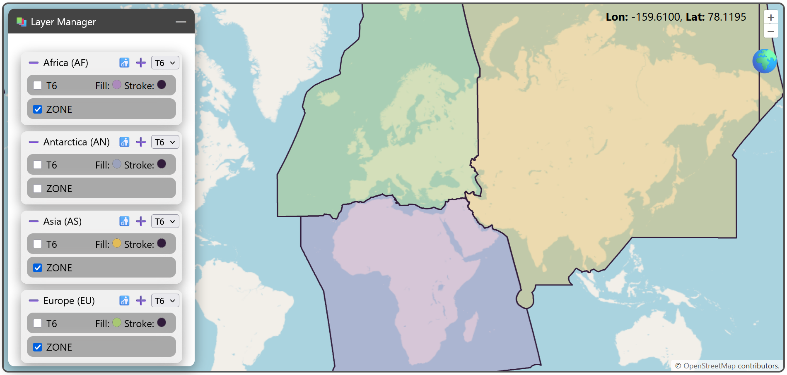
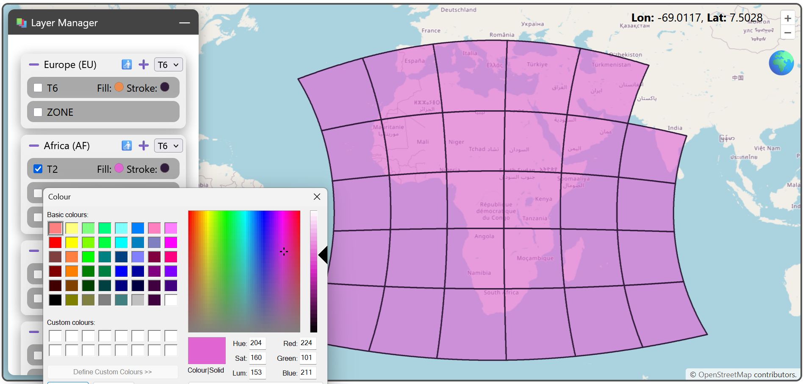
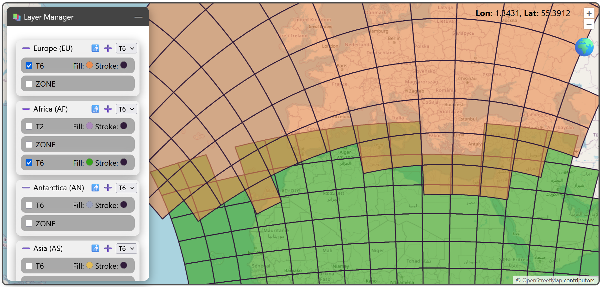
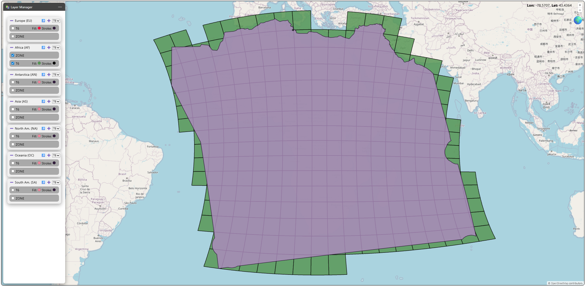

# Layer manager

The layer manager is a core tool of the webviewer allowing defining which and how layers are displayed. In addition, you can add new or remove tilings to the webviewer.

The following image shows the default view of the layer manager panel. By toggling checkbox next to each layer, you control its display on the map:

On the map, you can now interact with the layer by clicking on the tiles to display the tilename.

In the layer manager panel, the layers are grouped by Equi7Grid's continents, listing the respective zone and tilings for each continent. The ➖ symbol will minimise these groups individually. 

The symbols on the right side of the group manage layer loading and deletion. After selecting the tiling ID in the dropdown menu on the right, you can either remove the tiling with 🚮, or add it with ➕. Note that any non-standard tiling scheme needs to be added via the webviewer's [tiling creator](./tiling.md) tool.

For each continent, you can find a dedicated zone layer as a coloured polygon that represents the extent of Equi7Grid continental zone.

You can modify the stroke and fill colour of all tiling layers (but not for the zone layers).

All items are draggable to change the display order. This can be up and down within each group. In other words, you can drag the layers to achieve the desired visual overlay as seen in this example...

...or you can do the same with the continental groups (comprising per continent the zone and tile layers) and change the order of the continents, as here:

