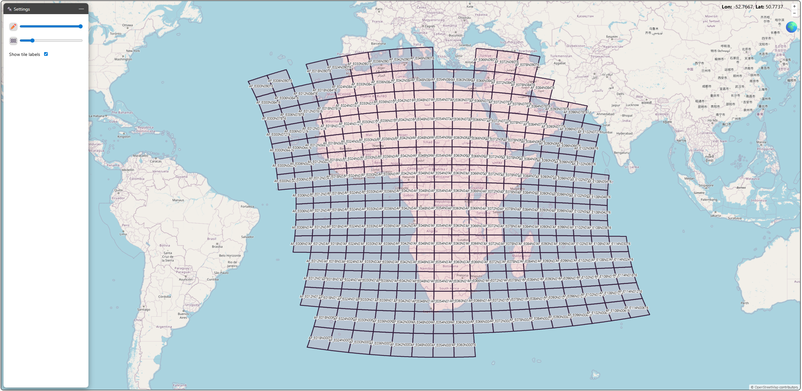

# Display settings

The display settings allow control over the stroke width of the tile outlines (✏️), and over the opacity of the tile filling (🏁).

:::{note}
Changing the stroke width is not supported in 3D.
:::

In addition, you can toggle if tile labels should be displayed, printing the tile names to the screen.
