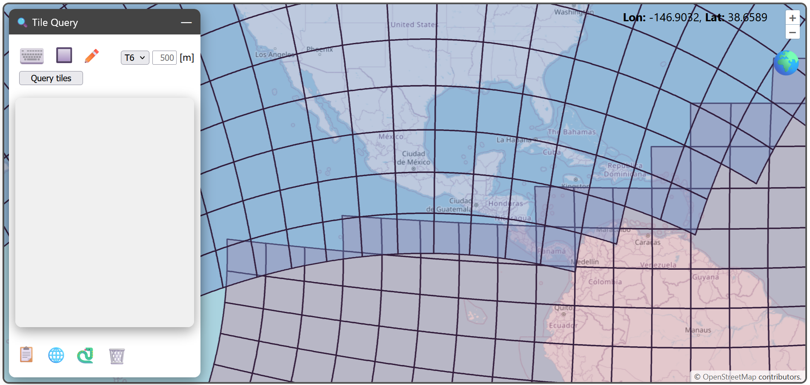
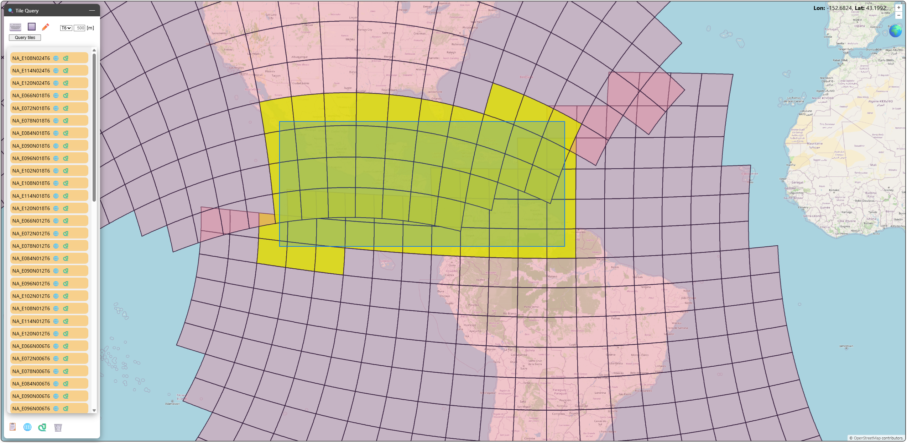
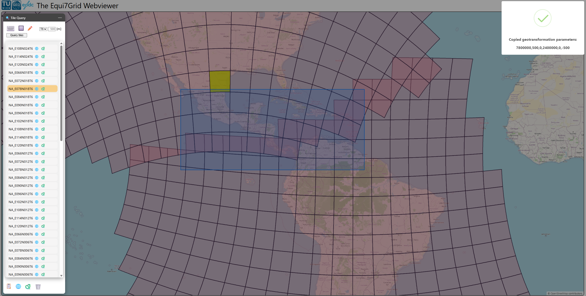

# Tile query

The tile query toolbar enables to submit tile queries for a certain region of interest. The result is a list of tiles, which can be exported into a list of tilenames, geotransformation parameters, and Python objects.

You have three options to define your region of interest:
- manually enter bounding box coordinates given in the LonLat system (⌨️)
- draw a bounding box (🔲). You can start drawing with a left-click and finish drawing with a right-click.
- draw a polygon (✏️). You can start drawing with a left-click and finish drawing with a right-click.

Next to the region of interest symbols, you can specify the desired sampling of the tiles. This is relevant for creating the correct geotransformation parameters and Python objects. Finally, you can specify the tiling ID from the dropdown menu.

:::{note}
If you change the sampling to a different value (other than 500m or one specified before) and submit the query, then all pre-computed objects need to be re-rendered. This takes significantly more time to finish the query.
:::

In the example below, we submit a query by entering a bounding box covering Central America. After execution, the tiles in the result are highlighted on the map (if the respective tiling is visible) and the tile list fills the area below the query form.

You highlight single tiles by clicking through the list. There are two symbols next to the tilename:
- 🌐: copy [GDAL's six geotransformation parameters](https://gdal.org/en/stable/tutorials/geotransforms_tut.html) to the clipboard
- 🐍: copy Python code allowing to generat an `Equi7Tile` instance to the clipboard

Here is an example, when copying the geotransformation parameters of a specific tile.

The symbols on the bottom perform exports on the whole tilelist:
- 📋: copy all tilenames to the clipboard (separated via a newline)
- 🌐: copy a JSON dictionary mapping tilenames to geotransformation parameters to the clipboard
- 🐍: copy Python code allowing to generate a Python dictionary mapping tilenames to `Equi7Tile` instances to the clipboard
