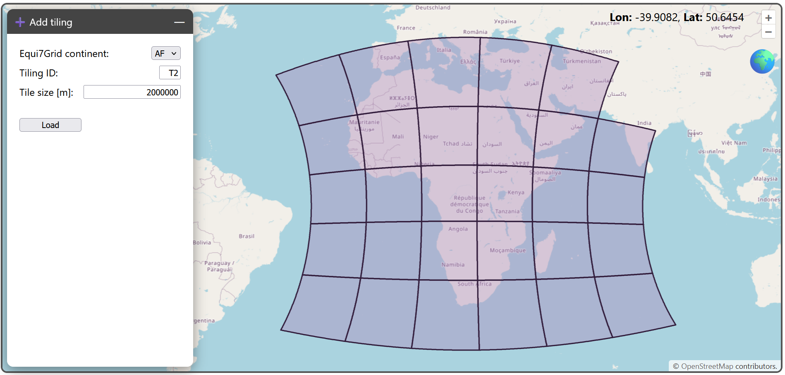

# Tiling creator

The tiling creator allows to create your own tiling scheme, in addition to the standard Equi7Grid tilings of 100km ("T1"), 300km ("T3"), and 600km ("T6").

The toolbar has three entries:
- the Equi7Grid continent
- the new tiling ID (two characters)
- the desired tile size in metres

After clicking on _Load_, the new tiling will be added to the existing tilings and will show up in the [layer manager](./layers.md). Note that this might take some time indicated by the loading circle in the lower-left corner.
